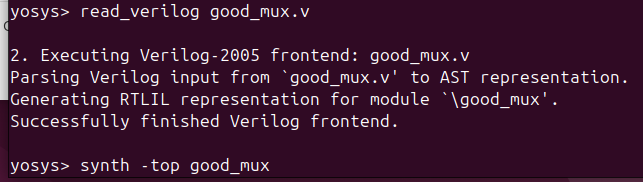
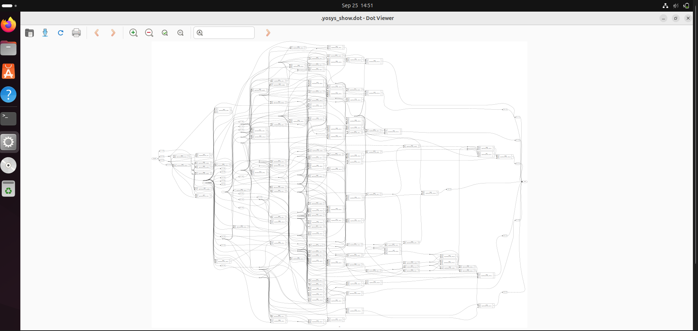

# week1-riscV-soc-tapeout-vsd
1st week tasks and project submissions for the VSD RISC-V SoC Tapeout program, documenting step-by-step progress from Week 0 to final tapeout.


# Day 1: Introduction to RTL Design, Simulation & Synthesis


## 1. Overview of RTL Design Flow

Register-Transfer Level (RTL) design is a critical stage in digital hardware design that describes how data moves between registers and how the logical operations are performed on the data. The process involves writing RTL code in hardware description languages (HDL) such as Verilog or VHDL, simulating the design with given specification to verify functionality, and synthesizing it into a gate-level netlist for hardware realization.


## 2. RTL Design and Simulation Theory

### What is RTL Design?

 RTL Design expresses the functionality of a digital circuit by describing how registers transfer data based on clock cycles and how combinational logic processes this data.
 Written in Verilog or VHDL, RTL is the interface between high-level system design and hardware.

### Simulation in RTL Design

- Simulation uses software tools to mimic and verify digital circuit behavior at the RTL before fabrication.
- It helps identify logical errors or mismatches early.
- Simulators like **Icarus Verilog** compile and run Verilog code and testbenches.
- A **testbench** is a special module that applies inputs (stimulus) to the design and checks outputs.


## 3. Block Diagram for RTL Simulation

## 🔹 Simulator
- A **simulator** is a software tool that executes the **design + testbench** interaction over simulated time.  
- It applies inputs, evaluates RTL behavior, and produces waveforms or logs.  
- Examples: **Icarus Verilog, ModelSim, Synopsys VCS**.  


## 🔹 Design (DUT)
- The **Design Under Test (DUT)** is your RTL code (Verilog/VHDL).  
- It describes the intended hardware functionality using registers and combinational logic.  
- This RTL code is the one later synthesized into hardware gates.  


## 🔹 Testbench
- A **Testbench** is a **non-synthesizable** module that:  
  - Generates input **stimuli** (drives inputs to DUT).  
  - Provides clock & reset.  
  - Observes DUT outputs.  
  - Compares results with expected values.  


## 🔹 Block Diagram 


---

## 4. Step-by-Step Simulation Using Icarus Verilog
Simulation is the process of using software tools to mimic the behavior of a digital circuit described in RTL and verify it before implementing it.

### 🔹 Block Diagram 


### a. Writing Verilog Code and Testbench
Use a text editor such as `gedit`:
```  
gedit alu.v
alu_tb.v
```
Write both your RTL modules and testbench files here.

### b. Compile the Code
compile both the codes using iverilog
```
iverilog alu.v alu_tb.v
```
or
```
iverilog alu.v alu_tb.v -o alu_sim
```
This compiles the Verilog code into an executable simulation file `alu_sim`.

### c. Run the Simulation
```
./a.out
```
or
```
vvp alu_sim
```
Executes the simulation and typically generates a `.vcd` waveform dump if `$dumpfile` and `$dumpvars` are used in the testbench.

---

## 5. Waveform Visualization Using GTKWave
When you run a simulation with **Icarus Verilog**, the **testbench** usually generates a `.vcd` file (Value Change Dump).  
This file stores all signal transitions (0/1/X/Z) during simulation.  
To debug and visualize these signals, we use **GTKWave**.

---

## 🔹 Step 1: Ensure VCD Dump in Testbench

Add the following lines in your testbench:

```verilog
initial begin
  $dumpfile("alu.vcd");   // create waveform file
  $dumpvars(0, alu_tb);   // dump all signals of testbench
end
```
After running the simulation with:
```
vvp alu
```
a file `alu.vcd` will be created in your working directory.

## 🔹 Step 2: Open GTKWave
To view the waveform:
```
gtkwave alu.vcd
```
👉 If you used a custom name, replace alu.vcd with that filename.

## 🔹 Step 3: Explore GTKWave GUI
When GTKWave opens:
- Left Panel → Shows your design hierarchy (modules, signals).
- Select Signals → Highlight the signals (e.g., A, B, opcode, Result).
- Insert Signals → Click Insert to move them into the waveform viewer.
- Waveform Window → Displays signal transitions over simulation time.
- Zoom/Scroll → Use toolbar buttons or mouse to zoom in/out and navigate.


---

## 6. Synthesis Theory

### What is Synthesis?

- Synthesis converts RTL descriptions into gate-level logic netlists based on a target technology.
- It produces a netlist showing gates and flip-flops mapped to a standard cell library.
- This gate-level netlist is used for physical implementation on ASIC/FPGA.

### Synthesizer

- A synthesizer is the software, like **Yosys**, that performs this function.
- It requires a **standard cell library (.lib)** containing timings and characteristics of real logic cells.

---

## 7. Synthesizing Using Yosys

### Preparing for Synthesis

- Clone the example repository containing `lib` files and Verilog sources:
```

git clone https://github.com/kunalg123/sky130RTLDesignAndSynthesisWorkshop
cd sky130RTLDesignAndSynthesisWorkshop
```
- `lib/sky130_fd_sc_hd__tt_025C_1v80.lib` is the key Liberty file for SkyWater 130nm PDK standard cells.
- `verilog_files/` contains example designs such as `mux.v` and `counter.v`.

### Running Yosys Synthesis Commands

Read the standard cell library
```
read_liberty /path/to/sky130_fd_sc_hd__tt_025C_1v80.lib
```

Read the RTL Verilog file
```
read_verilog alu.v
```
Set the top-level module
```
hierarchy -top alu
```
Run synthesis steps
```
synth -top alu
abc -liberty /path/to/sky130_fd_sc_hd__tt_025C_1v80.lib
```

Write synthesized netlist
```
write_verilog -noattr alu_netlist.v
```
Optionally view schematic
```
show
```

Exit yosys
```
exit
```
*Insert Yosys Block Diagrams*  
  
  
  
  
  
  
  


---

## 8. Summary

By the end of Day 1, I gained a clear understanding of the RTL design process and its importance in digital hardware development. I learned how to write Verilog RTL code along with a testbench, simulate the design using Icarus Verilog, and generate `.vcd` files for further analysis. I also explored how to visualize and analyze signal transitions and timing behavior using GTKWave, which helps in debugging and validating functionality. In addition, I understood the basics of synthesis using Yosys, including how RTL code is mapped to standard cell libraries to generate a gate-level netlist. Overall, I learned how open-source tools like Icarus Verilog, GTKWave, and Yosys provide a complete RTL-to-netlist flow that can be applied in ASIC and FPGA design.

